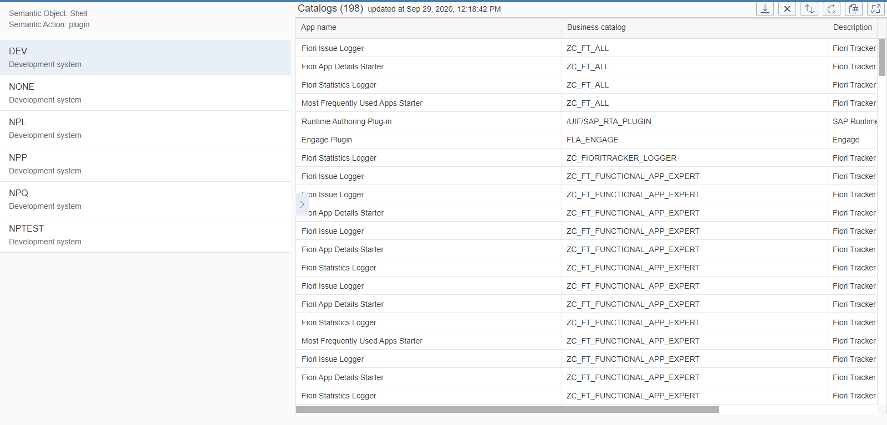

# App Catalogs Report

Application provides the list of SAP Fiori catalogs assigned to SAP Fiori app in the chosen system. The list is presented as a SAP Fiori Smart Table with custom sorting and Microsoft Excel file format export.

 

## [Installation](inst.md)

## Available extensions
Optional extension that enables view of the catalogs in relation to friendly application name.
[Fiori Tracker Core](../../core/SPS02/main.md) with [FT Apps Relation: Catalogs, As-is](../../ft-apps-rel-catalogs-asis/FPS01/main.md)

## Other applications that might use the product
[FT Apps Relation: Catalogs, As-is](../../ft-apps-rel-catalogs-asis/FPS01/main.md)

## Dependencies
Requires:  
[As-is](../../asis/FPS01/main.md)

## [Technical information](tech.md)

