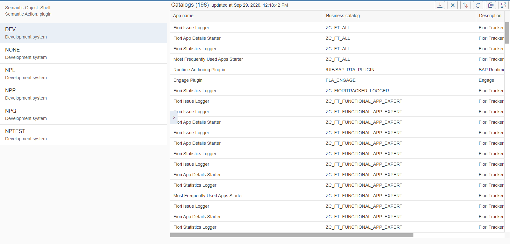

# App Catalogs Report

Application provides the list of SAP Fiori catalogs assigned to SAP Fiori app in the chosen system. The list is presented as a SAP Fiori Smart Table with custom sorting and Microsoft Excel file format export.

 

If you have Fiori Tracker Core installed in your system, installing App Catalogs Report will enable an additional relation called "Catalog As-is." Catalog As-is relation will become active in FT Apps application and enables view of the catalogs in relation to friendly application name:

## [Installation](inst.md)

## Dependencies
Requires:  
[As-is](../../asis/FPS01/main.md)

## [Technical information](tech.md)

