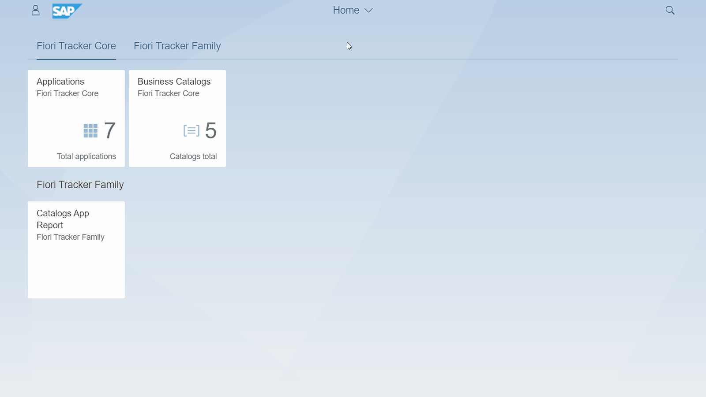

# FT Applications

## Attributes of App To-be record

Fiori Tracker keeps the following attributes for an app entry:

| Name      | Description                                                                                                             |
|-----------|-------------------------------------------------------------------------------------------------------------------------|
| Id        | App identifier. For SAP standard application, we recommend the use of application id from Fiori Apps Library        |
| Name      | The name of the application                                                                                             |
| Tile tile | The name to be set for Fiori Launchpad tile                                                                           |
| Area      | Functional area chosen from the list of areas in your project. The list is configurable.                             |
| Type      | Type of the application. Fiori Tracker comes with predefined application types. The list is configurable.             |
| Created   | The date on which the application "To-be" entry was created.   Its the date of including the app into the project scope. |
| Modified  | The date the attributes of the app were changed    