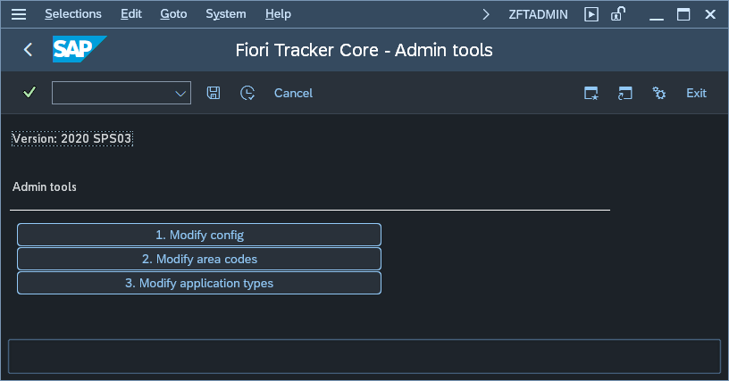

# Configuration - Fiori Tracker Core

To configure Fiori Tracker core use SAP Gui transaction **ZFTADMIN**:

## 1.  Modify config

This function allows you to set [configuration parameters](conf-params.md).

## 2.  Modify area codes

This function allows you to set you functional area codes.

## 3.  Modify application types

Allows you to modify or add the application types.

