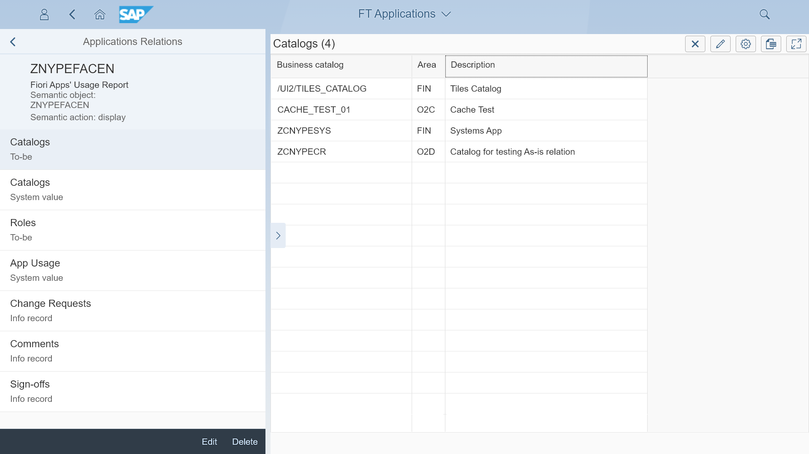

# Fiori Tracker Core

Fiori Tracker Core is a pair of apps for keeping a record of your SAP Fiori launchpad's implementation or maintenance scope. It makes a foundation for linking launchpad apps records with other project information types.

## Key features
- Easy app identification 
- Intuitive view on application's details 
- Clarity on responsibility with unique stream ownership
- Link between apps and catalogs
- Apps and catalogs linkage to other types of information (available as extensions): roles, test users, change requests, comments, change history records, implementation and test status, actual system information values and app's usage statistics

Fiori Tracker Core contains the following applications: 

[FT Applications (with core relation: To-be catalogs)](../../core/SPS03/apps.md) - for keeping "To-be" records of applications in scope

[FT Catalogs (with core relation: To-be apps)](../../core/SPS03/cats.md) - for keeping "To-be" records of catalogs in scope

## [Installation](inst.md)

## [Configuration](conf.md)

## [Available extensions](ext.md)

## Dependencies
Independent - does not need any other product to be installed

