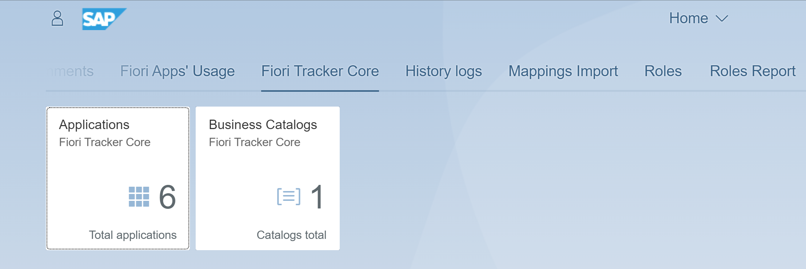

# Simplify the process of getting SAP Fiori launchpad content requirements

Fiori Tracker [helps SAP teams](satisfied-intrests-and-roles.md) create and handle list of your SAP Fiori launchpad enabled apps. 

From [gathering requirements](usecases/SPS03/requirements-gathering.md) to linking with actual setup and [usage statistics](fa/FPS01/main.md) - Fiori Tracker helps you get rid of repetitive tasks and cut project time from weeks down to days.

# Host in your SAP landscape
Fiori Tracker comes as a native SAP Fiori app that you can install on any SAP Gateway in your SAP landscape.

# Compatibility
Compatible with SAP S/4HANA releases from 1610 to 2022.