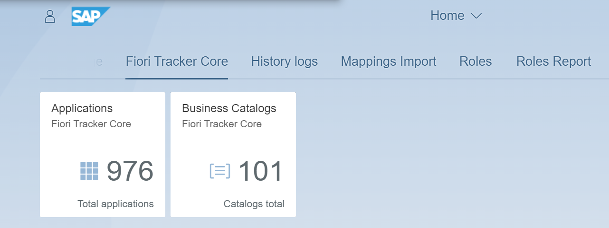

# Boost your SAP project team productivity with automation

Fiori Tracker [helps SAP teams](satisfied-intrests-and-roles.md) create and handle specification for SAP Fiori setup.

From [gathering requirements](usecases/SPS03/requirements-gathering.md) to linking with actual setup and usage statistics - Fiori Tracker helps you avoid common stumble points and cut project time from weeks down to days.

# Host in your SAP landscape
Fiori Tracker comes as a native SAP Fiori app that you can install on any SAP Gateway in your SAP landscape.

# Handy add-ons available
Fiori Tracker offers a stack of relations linking your SAP Fiori apps and catalogs to other information (system values, usage statistics). Choose and install only the relations you need.

