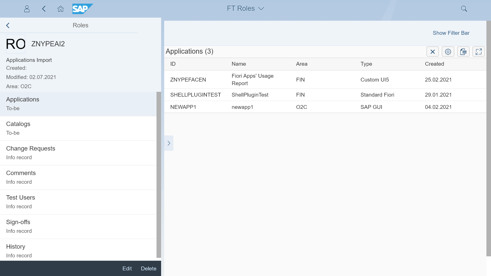

# Fiori Tracker Roles

FT Roles component provides [an app](ro-apps.md) and relations for keeping the record of your SAP Fiori launchpad's roles.

## Key features
- Easy role identification 
- Intuitive view on role's details 
- Clarity on responsibility with unique stream ownership
- Links to apps and catalogs (build in)
- Links to change requests, sign-offs, test users, history (installable)

## [Installation](inst.md)
