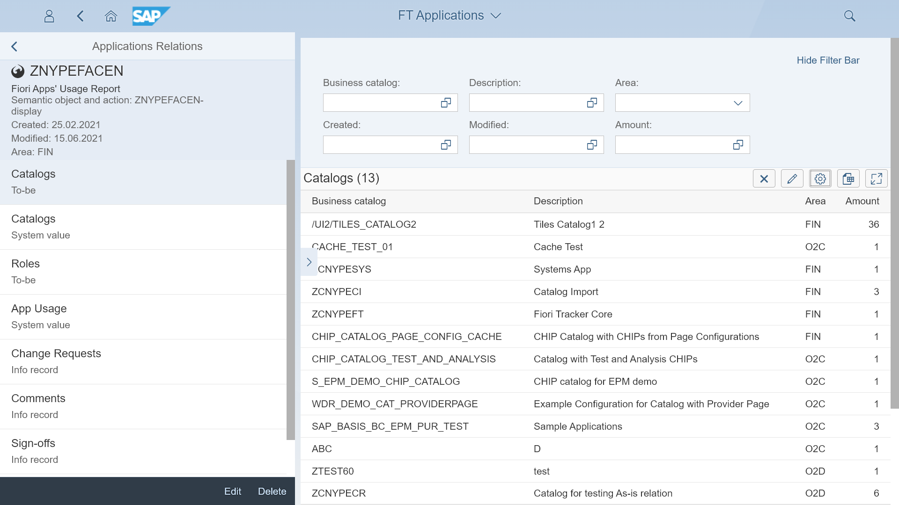
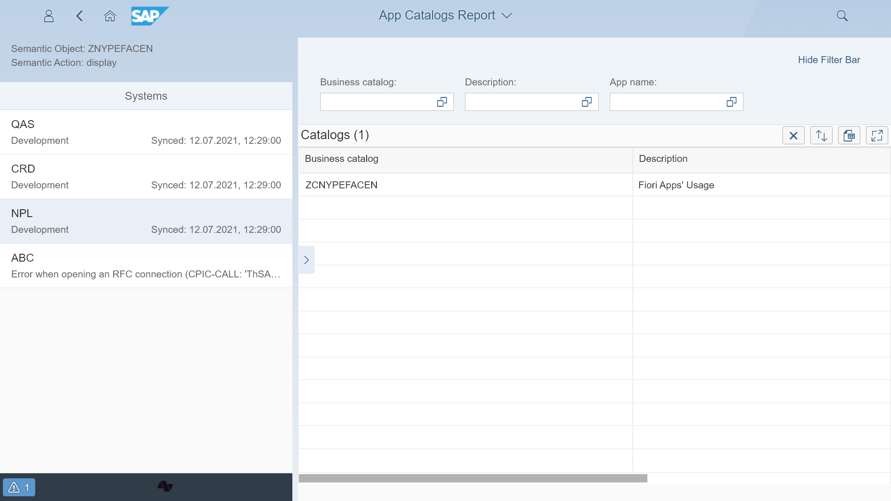

# Content type: Applications

Fiori Tracker can keep records of all your applications. Application entry serves as a reference for application-related content types lists. The content you can list with the application is the catalogs (To-be and As-is), roles, change requests, comments, sign-offs, and history.

