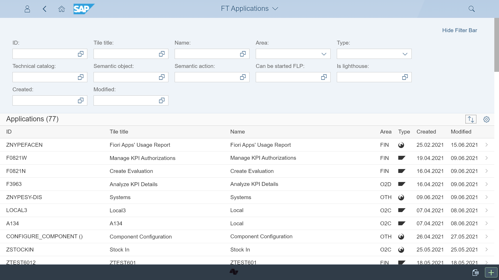
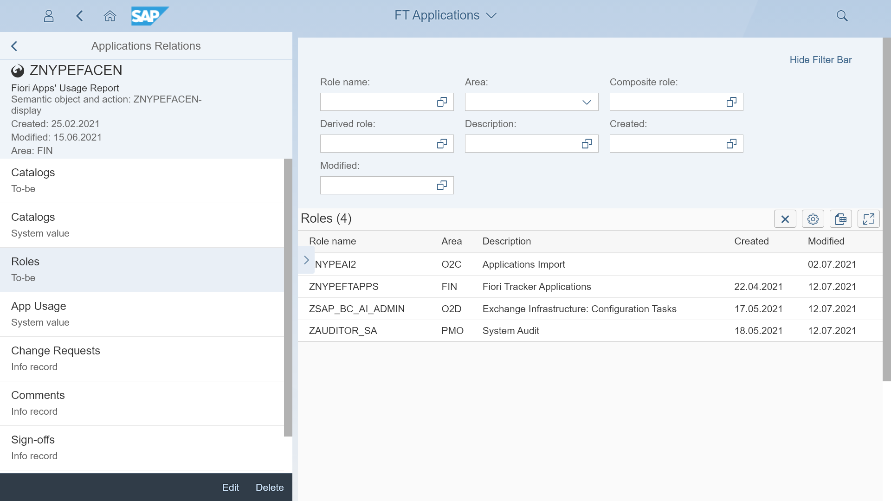
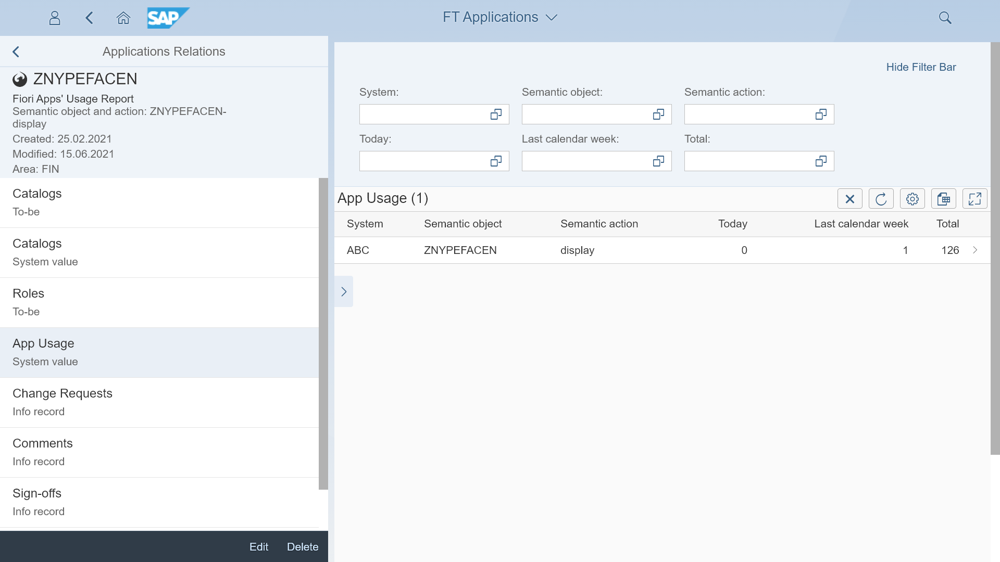
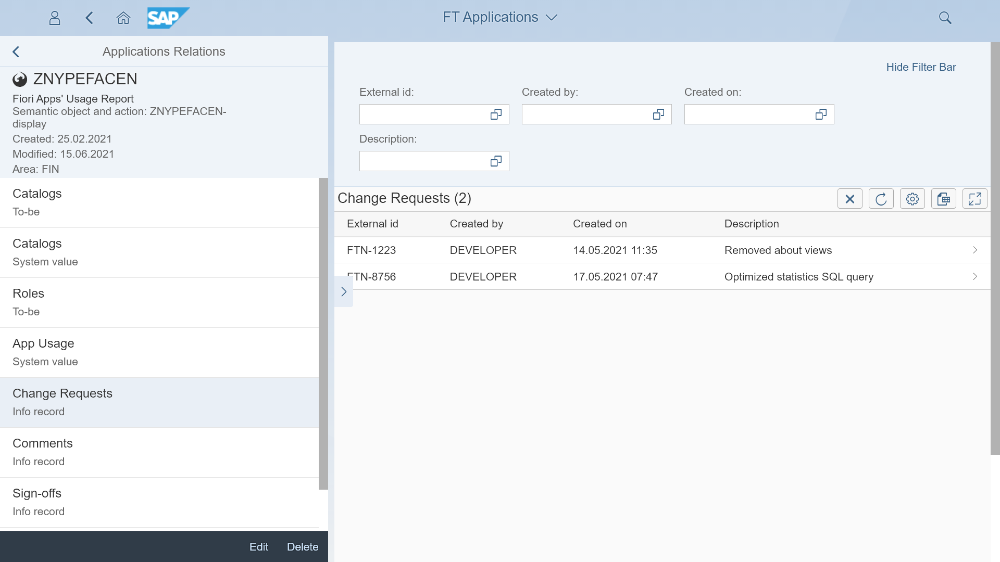
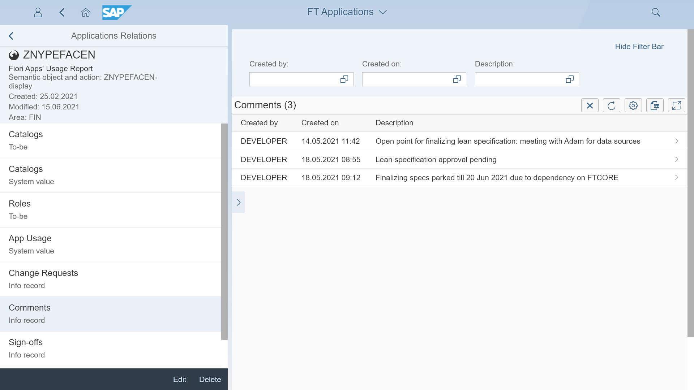
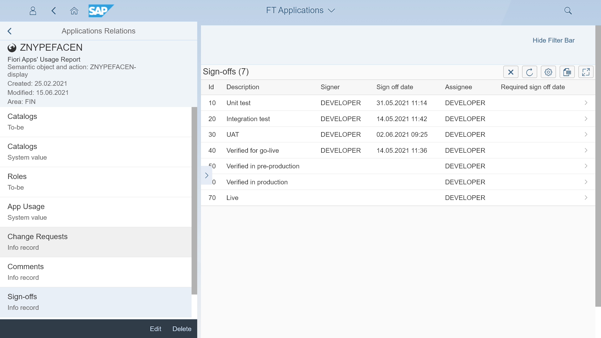
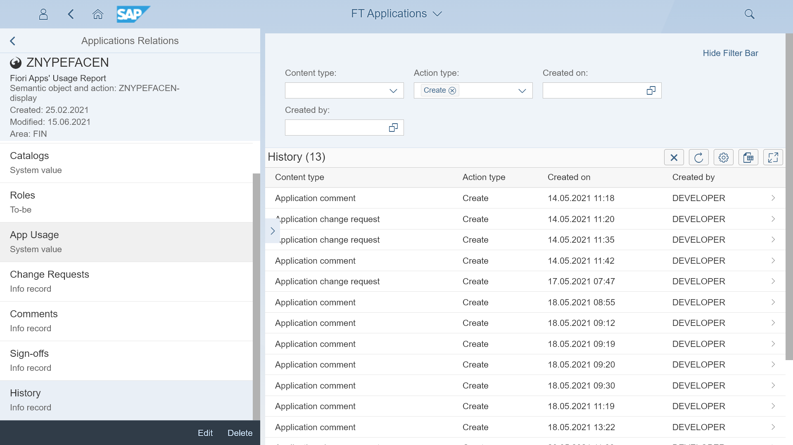

# Content type: Applications

Fiori Tracker can keep records of all your applications.

## Linkage to other content types
 
 Application entry serves as a reference for application-related content types lists. The content you can list with the application is:

- [Catalogs (To-be)](app-cats-tobe.md)
- [Catalogs (As-is)](app-cats-asis.md)
- Roles
- Change requests
- Comments
- Sign-offs
- History

