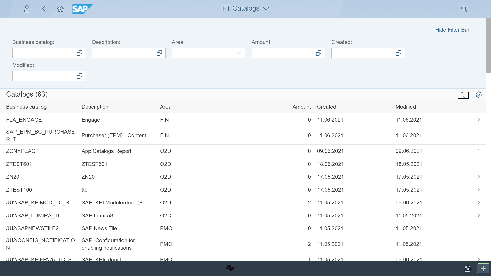
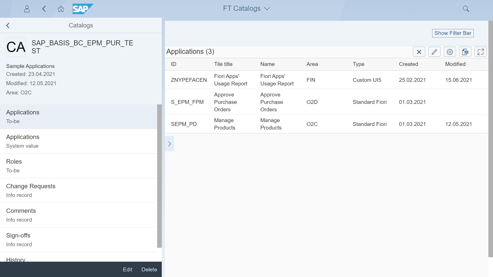
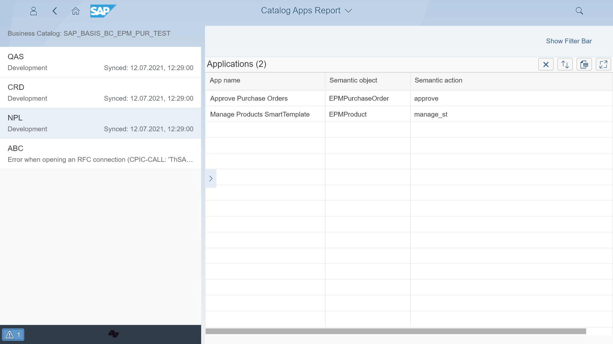
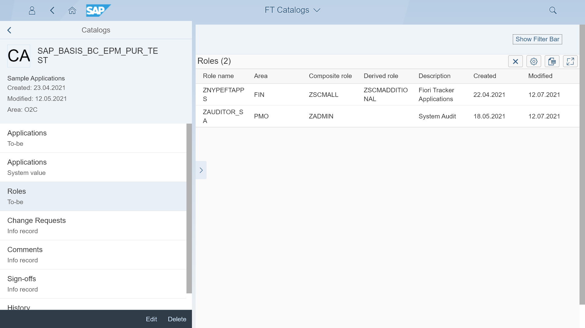
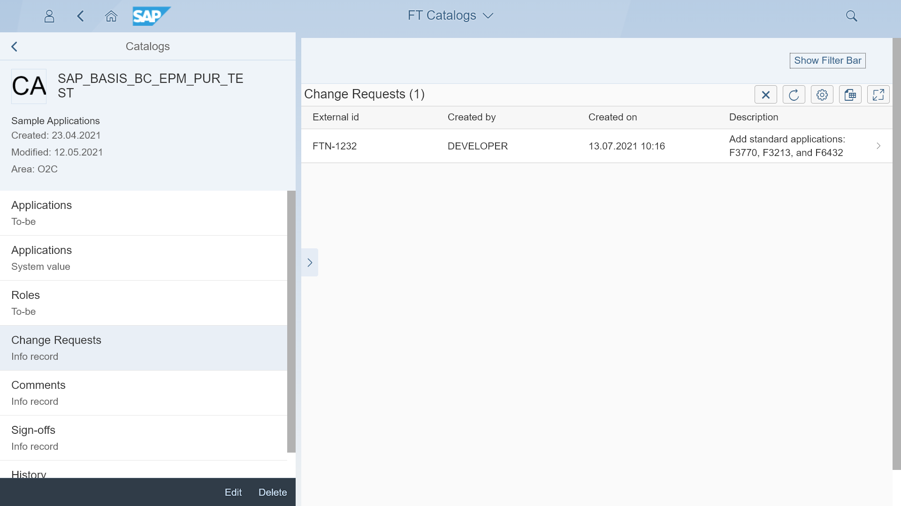
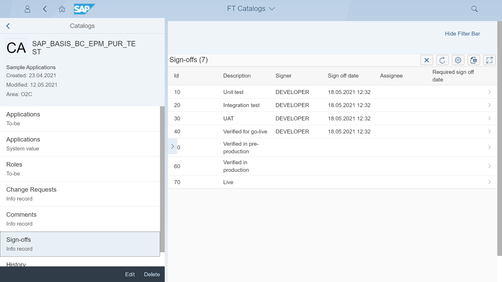
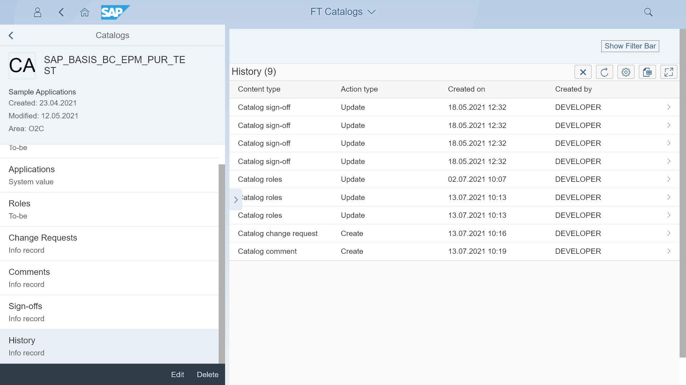

# Content type: Catalogs

Fiori Tracker can keep records of all your catalogs. Catalogs entry serves as a reference for catalog-related content types lists. The content you can list with the catalog are applications (To-be and As-is), roles, change requests, comments, sign-offs, test users records, and history.

