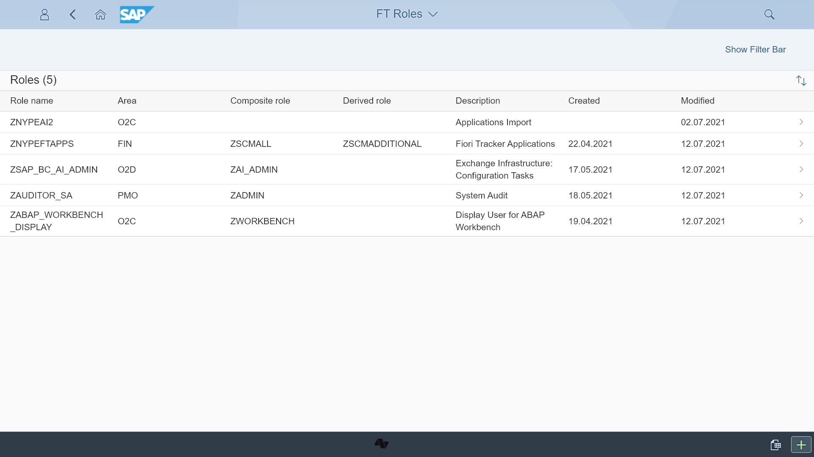
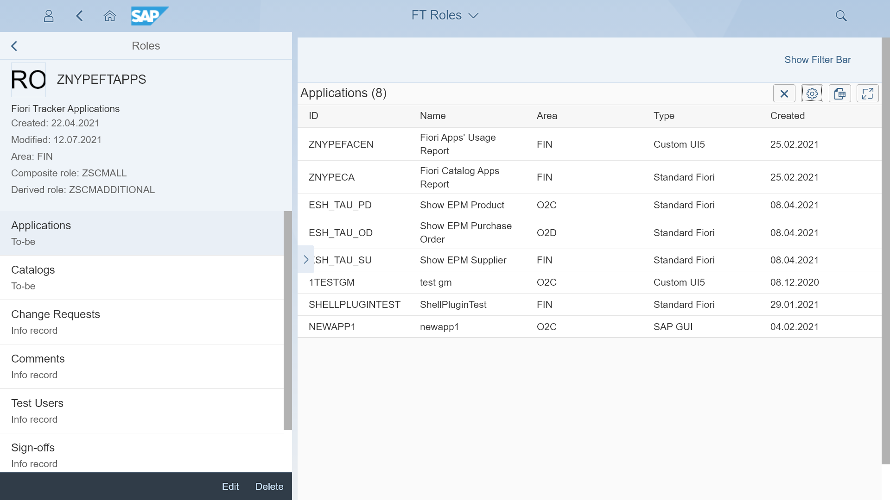
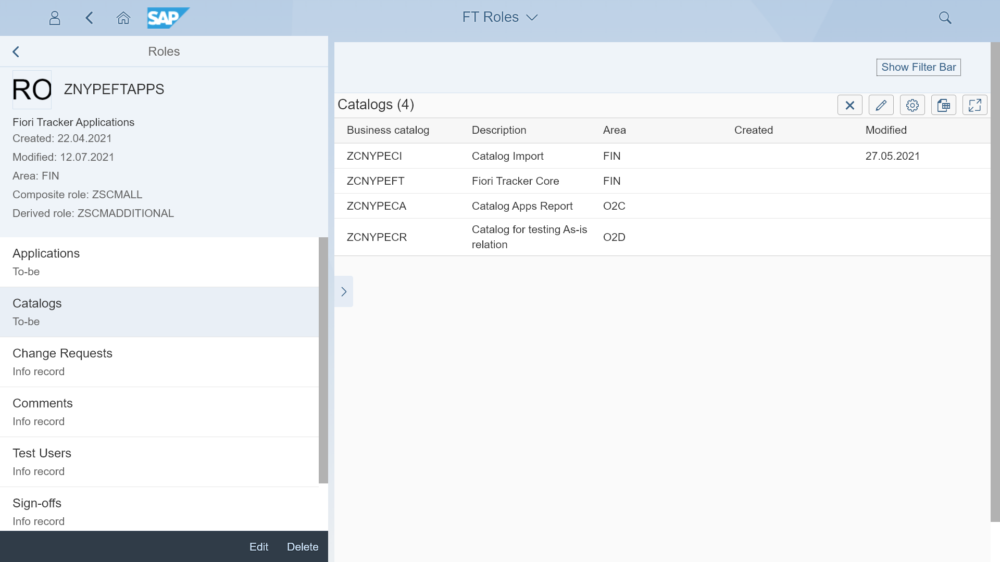
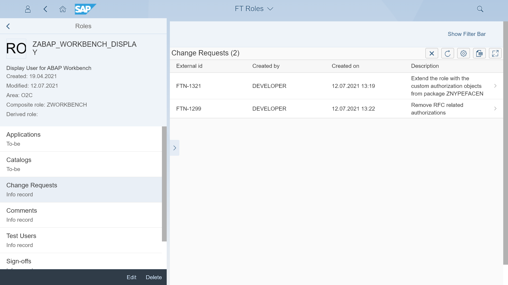
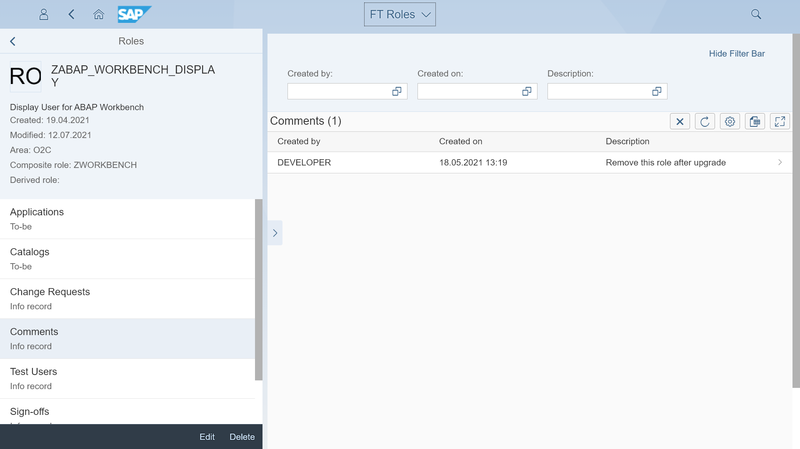
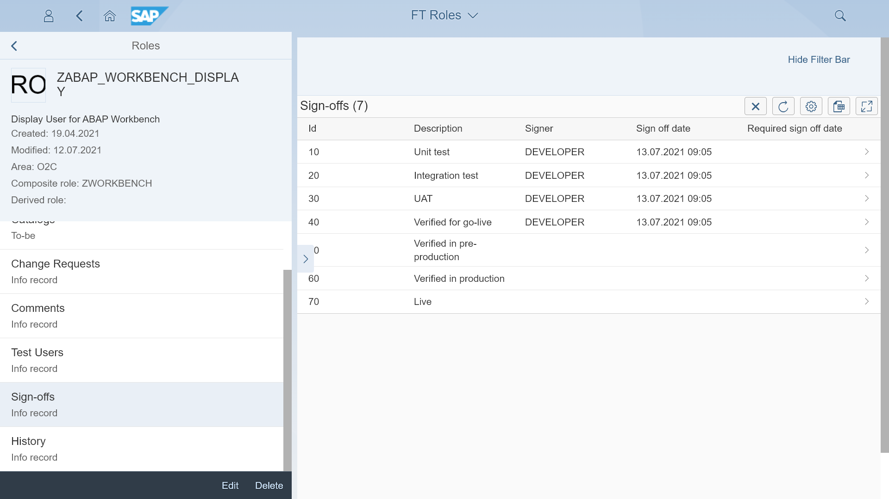
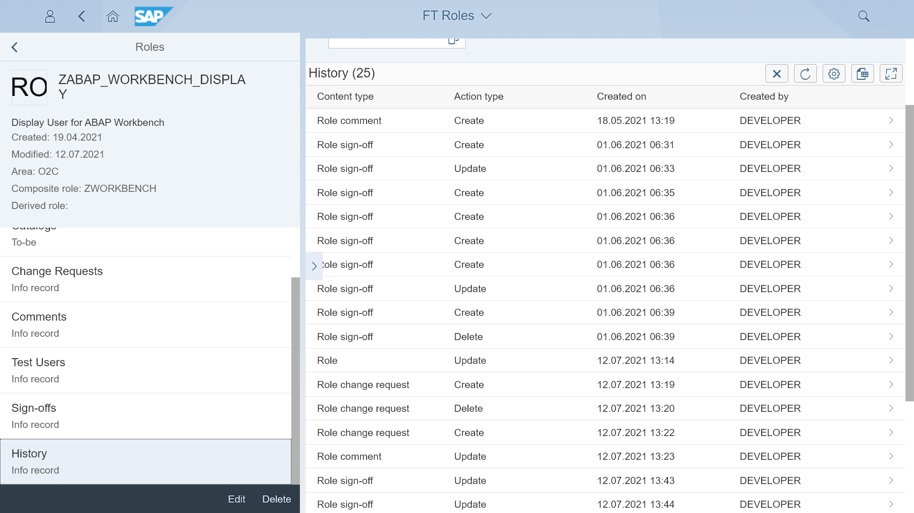

# Content type: Roles

Fiori Tracker can keep records of all your roles. Roles entry serves as a reference for role-related content types lists. The content you can list with the role are applications, catalogs, change requests, comments and test users records.

