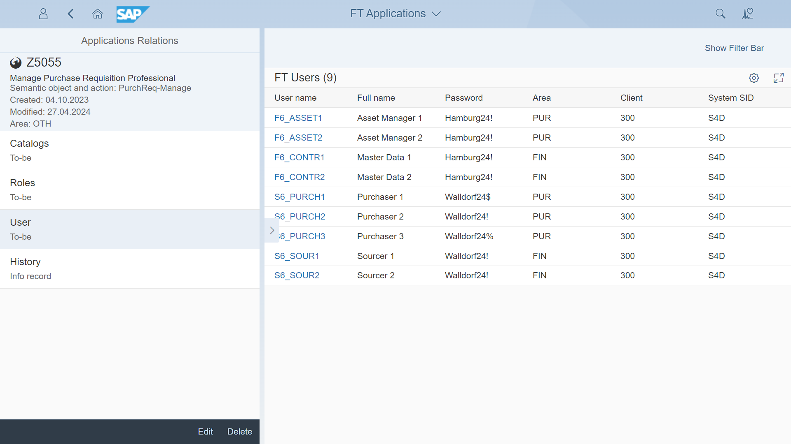
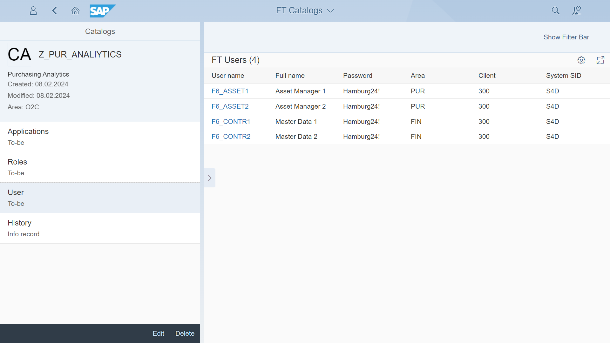
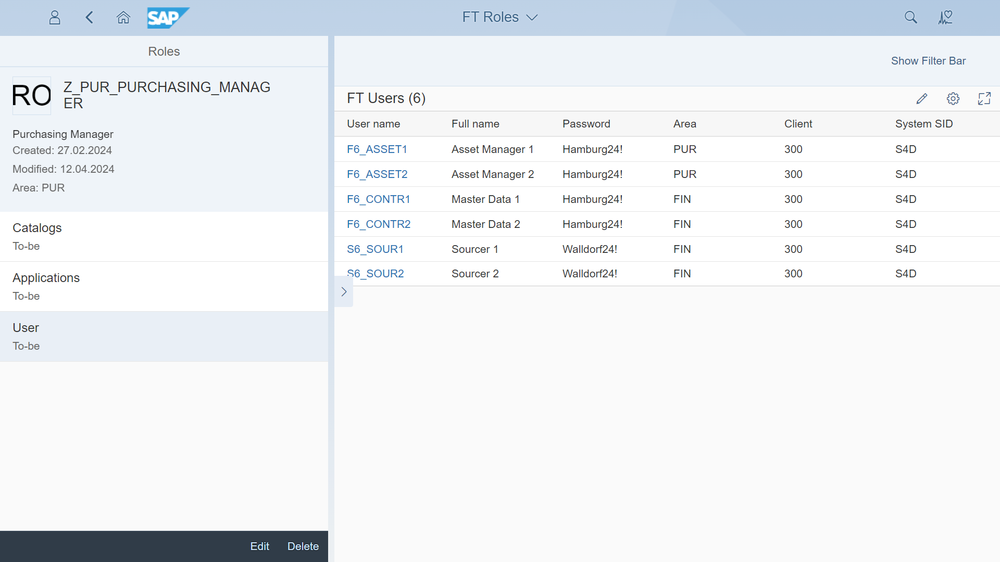

# Content type: Test users

The test users app keeps stores a list of users along with their passwords and roles associations. This makes it easy to find test users based on their roles, which are also linked to catalogs and apps. Using indirect linkage, you can quickly find all the test users for a specific app or catalog.

You can get the test users linked through catalogs and roles to a particular app:

Also, linked through roles to a particular catalog:

Or, mapped directly to role:

