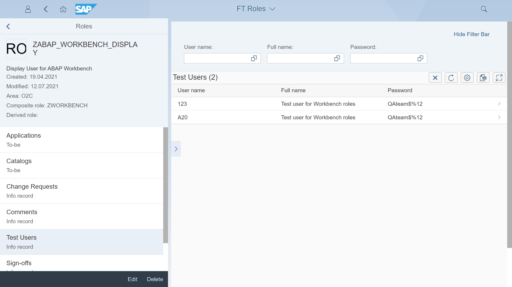

# Test users

The Test users app lets you create, change, and list test user records. After installing the app the Roles relation "Test users" is enabled. The relation shows all test users with passwords linked to a specific role.

## [Installation](inst.md)

## [Configuration](conf.md)

