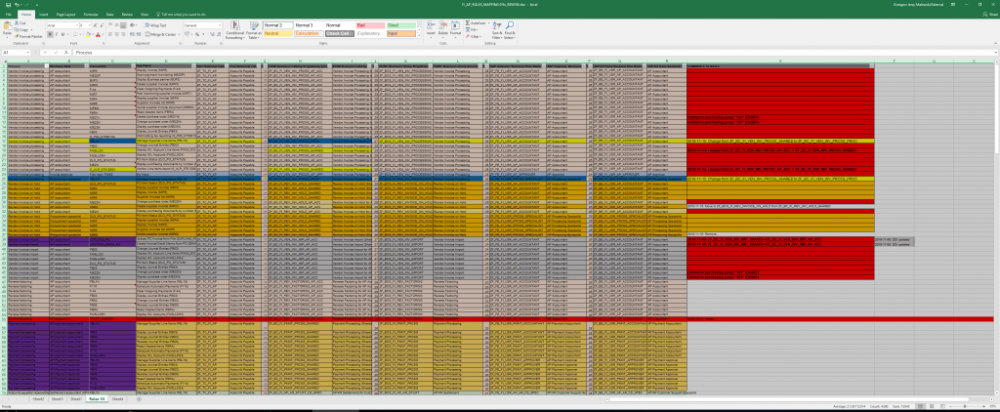

# Fiori Launchpad Content requirements gathering

Collecting requirements in the preparation phase of SAP implementation requires teamwork. Both technical and functional experts are involved. For large projects with multiple streams, the team needs a central directory of agreed Fiori Launchpad content. Usually, the team uses a shared spreadsheet. Unfortunately, shared sheets often get out of sync, making most of the parts out of date. Once they are out of date, handling any catalog or role changes becomes a nightmare.

 Rather than storing your Fiori launchpad content details in spreadsheets, you manage them with a dedicated app: Fiori Tracker. The application enables data quality control, as it limits possible entries only to the correct ones. The application also checks certain fields to prevent duplication. The check is crucial, for example, for catalogs and Fiori app identifiers. You can see how the existing apps are linked with the existing catalogs and what impact the changes will have to the catalogs. You get the view on the history of the changes. All changes get logged with user, date and time stamp.
 
## The challenges

The following are the challenges that the team will face when storing scope detail in the spreadsheet.

|Challenge|Description|Fiori Tracker function|
|--|--|--|
|Duplication | Different team members can easily create duplicate records for the same content|On each record creation Fiori Tracker checks if the record already exists and does not allow creating duplicates.|
|Maintaining 1 to N mapping | It is not possible to maintain and present in an easily readable form the 1 to N relation that is needed for mapping apps to catalogs. The same applies for catalogs to roles, and roles to users mapping. |Fiori Tracker enables maintaining the mapping of an app to many catalogs and automatically updates the view showing all the apps for one catalog|
|Consistency | When adding a new app to the spreadsheet, it is relatively hard to check whether the app is already present in other catalogs. In that case, it could make sense to reuse an existing catalog. | With Fiori Tracker you can see which catalogs use the app and which one would be the best match for the role. This limits the number of catalogs and the overall complexity of Fiori launchpad configuration. |

