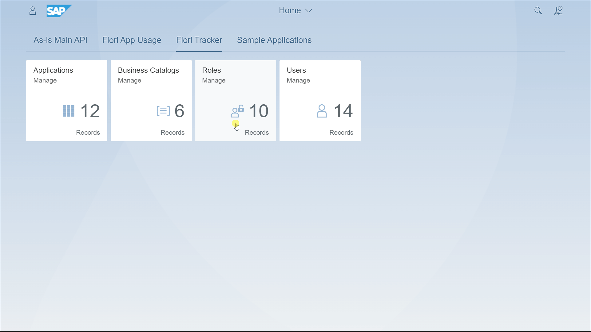

# Centralized test users lists with passwords

Shared test users list: Once your custom app is ready, your SAP Fiori developer can dive in for unit testing and see exactly what the SAP Functional expert will see in his testing.

However, test users face access issues like blocked access, expired passwords, and frequent changes, delaying sign-offs and production releases.

Instead of scrambling with e-mailed lists, you can rely on the Test User app. This handy app logs all our test users, centralizes management and is accessible to everyone in the QA system.

